<p align="center">
  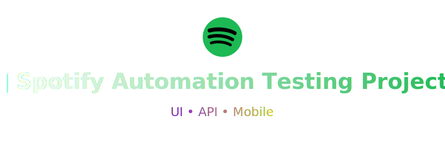
</p>

# Spotify Automation Testing Project

## 📘 О проекте  
**Spotify Automation Testing Project** — это дипломный проект, цель которого — продемонстрировать навыки автоматизации тестирования API и UI для реального веб-приложения.  
В данном случае выбирается Spotify (веб-версия + Web API) и проверяется:  
- корректность работы API Spotify (авторизация, работа с плейлистами, библиотекой)  
- корректность работы пользовательского интерфейса веб-версии Spotify  
- интеграция тестов, отчётности и уведомлений  

## 🎯 Почему именно этот проект?  
- Используется **реальное приложение**, а не учебный шаблон ( о чем я тысячу раз пожалела, ибо Spotify очень злой).  
- Проект охватывает оба направления тестирования: **API** и **UI**.  
- Реализована цепочка: тесты → отчётность (Allure Report) → Jenkins → уведомления в Telegram.
  

## 🚀 Технологический стек  
<p align="center">
  
  
  
  
  
  
  
  
</p>

- **Python 3.11+** — современная версия, поддержка типизации и новых возможностей.  
- **Pytest** — тестовый фреймворк для написания и запуска тестов, маркировки, фикстуры.  
- **Selene** — удобная обёртка над Selenium, реализующая Page Object подход.  
- **Requests** — выполнение HTTP-запросов в API-тестах.  
- **Pydantic** — валидация JSON-ответов API, поддержка моделей.  
- **Allure Report** — визуализация отчётов тестирования с выводами, прикреплёнными скриншотами и логами.  
- **Jenkins** — CI/CD автоматизация, сборки, отчёты, публикации.  
- **Telegram Bot** — уведомление о результате сборки/тестов с логотипом, статистикой и ссылкой на отчёт.

<br>

---

| ✨ UI Тесты                              &nbsp;&nbsp;&nbsp;&nbsp;&nbsp;&nbsp;&nbsp;                                       |
| -------------------------------------------------------------------------- |
| Успешная авторизация пользователя                                          |
| Авторизация с неверным паролем                                             |
| Авторизация с пустыми полями                  &nbsp;&nbsp;&nbsp;&nbsp;&nbsp;&nbsp;&nbsp;&nbsp;&nbsp;&nbsp;&nbsp;&nbsp;&nbsp;        &nbsp;&nbsp;&nbsp;                            |
| Авторизация с невалидным логином                                           |
| Проверка отображения деталей трека в результатах поиска                    |
| Проверка игнорирования и успешного вывода при опечатке в поисковом запросе |
| Проверка сообщения при отсутствии результатов поиска                       |
| Переход на страницу артиста из результатов поиска         &nbsp;&nbsp;&nbsp;&nbsp;&nbsp;                 |
| Проверка карточки альбома в результатах поиска                                     |
| Применение фильтра «Исполнители» в поиске               &nbsp;&nbsp;&nbsp;&nbsp;&nbsp;                   |


<br>
<br>


| 🔧 API Тесты                         &nbsp;&nbsp;&nbsp;&nbsp;&nbsp;&nbsp;&nbsp;                                             |
| ----------------------------------------------------                    |
| Получение данных текущего пользователя                                   |
| Получение публичного плейлиста              &nbsp;&nbsp;&nbsp;&nbsp;&nbsp;&nbsp;         |
| Негативный кейс: поиск несуществующего плейлиста     |
| Негативный кейс: невалидный поиск                    |
| Создание и удаление плейлиста               &nbsp;&nbsp;&nbsp;&nbsp;&nbsp;         |
| Негативный кейс: создание плейлиста без имени                          |
| Добавление трека в существующий плейлист             |
| Добавление и удаление выбранного трека               |
| Негативный кейс: добавление несуществующего трека &nbsp;&nbsp;&nbsp;&nbsp;&nbsp;  |
| Работа с файлами: загрузка обложки плейлиста         |
| Добавление, проверка и удаление альбома        &nbsp;&nbsp;&nbsp;&nbsp;&nbsp;&nbsp;&nbsp;&nbsp;&nbsp;&nbsp;      |
| Негативный кейс: сохранение несуществующего альбома  |
| Подписка и отписка от артиста               &nbsp;&nbsp;&nbsp;&nbsp;&nbsp;&nbsp;&nbsp;         |
| Негативный кейс: подписка на несуществующего артиста |
<br>

---

## ⚙️ Установка и запуск

Все тесты в проекте (UI и API) запускаются удалённо (Jenkins), но их можно запустить и локально.

<details>
<summary><b> 🔐 Запуск локально</b></summary>

Для запуска тестов локально, нужно выполнить следующие шаги:

1.  Склонировать репозиторий:
    ```bash
    git clone [https://github.com/AlishaMeier/diploma_project_spotify.git](https://github.com/AlishaMeier/diploma_project_spotify.git)
    cd diploma_project_spotify
    ```
2.  Открыть проект в PyCharm.
3.  Создать `.env` файл в корне проекта (по образцу `.env.example`) и заполнить его своими данными (креды для UI-тестов, токен для API).
4.  Ввести в терминале следующие команды для настройки окружения:
    ```bash
    python -m venv .venv
    source .venv/bin/activate 
    # (или .\.venv\Scripts\activate для Windows)
    pip install -r requirements.txt
    ```

5.  Выполнить запуск тестов:
    ```bash
    # Для запуска API тестов
    pytest -m api
    ```
    ```bash
    # Для запуска UI тестов (в локальном браузере, тк по умоляанию у нас запускается удаленно)
    pytest -m ui --driver-type=local
    ```
    </details>
<br>

<details>
<summary><b> 🔐 Запуск с помощью Jenkins</b></summary>

Для запуска автотестов необходимо:

1.  Открыть эту **[Job](https://jenkins.autotests.cloud/job/ui_tests_diploma_project_spotify_am/)** в Jenkins для UI или [эту](https://jenkins.autotests.cloud/job/api_tests_diploma_project_spotify_am/) для API.
2.  Нажать на кнопку **Build with Parameters**.
3.  Выбрать необходимые значения параметров
4.  Нажать на **Build**.

</details>

<br>

<details>
<summary> <b> 🔐 Инструкция по авторизации в Spotify API </b></summary>


<br>Для запуска тестов, изменяющих данные пользователя (создание плейлистов, добавление треков, подписки), требуется `access_token` с определенными скоупами (scopes).
<br>
<details>
<summary><b>Требуемые Scopes (разрешения) для API-тестов</b></summary>
<br>

Для корректной работы API-тестов OAuth-токен (`SPOTIFY_API_TOKEN`) должен быть сгенерирован со следующими разрешениями (scopes):
<br>
* **Профиль пользователя (`test_user_profile.py`)**:
    * `user-read-private` (для чтения личных данных профиля)
    * `user-read-email` (для чтения email)
* **Медиатека: Альбомы (`test_spotify_albums.py`)**:
    * `user-library-read` (для проверки списка сохраненных альбомов)
    * `user-library-modify` (для добавления и удаления альбомов)
* **Медиатека: Подписки (`test_spotify_following.py`)**:
    * `user-follow-modify` (для подписки и отписки от артистов)
* **Плейлисты: Чтение (`test_spotify_playlist.py`)**:
    * `playlist-read-private` (для чтения приватных плейлистов)
    * `playlist-read-collaborative` (для чтения совместных плейлистов)
* **Плейлисты: Изменение (`test_spotify_playlist.py`)**:
    * `playlist-modify-public` (для создания/удаления/изменения публичных плейлистов и добавления/удаления треков)
    * `playlist-modify-private` (для тех же действий с приватными плейлистами)
* **Плейлисты: Загрузка обложки (`test_spotify_playlist.py`)**:
    * `ugc-image-upload` (специальный scope для загрузки изображений)

</details>
<br>

### Как получить токен:

1.  **Настройте приложение в Spotify Dashboard** (делается один раз):
    * Перейдите в [Dashboard](https://api.spotify.com/v1/me) и создайте новое приложение.
    * В настройках приложения (`Settings`) добавьте `https://example.com/callback` в поле **Redirect URIs** и сохраните изменения.
    > ***Пример*** – ``

2.  **Сформируйте и перейдите по ссылке для авторизации**:
    * Соберите URL, подставив ваш `client_id` и необходимые `scopes`.
    * Пример ссылки со всеми нужными правами – `[...вставь свою ссылку сюда...]`
    * Перейдите по ссылке, войдите в Spotify и разрешите доступ.

3.  **Обменяйте `code` на `access_token`**:
    * После подтверждения вас перенаправит на `example.com`. Скопируйте значение параметра `code` из адресной строки.
    * Выполните `curl`-запрос в терминале/postman, подставив ваш `code`, `client_id` и `client_secret`, чтобы получить `access_token`.

4.  **Сохраните токен**:
    * Вставьте полученный `access_token` в Jenkins в переменную `SPOTIFY_API_TOKEN`.

> **Важно**: `access_token` действует около 1 часа. Если тесты начнут падать с ошибкой 401, просто повторите процедуру для получения нового токена.

</details>

---

## 📊 Отчетность и Интеграции

###  Allure Report

<table align="center" border="0" style="border: none; margin-left: auto; margin-right: auto;">
  <tr>
    <td align="center" style="border: none; padding: 10px;">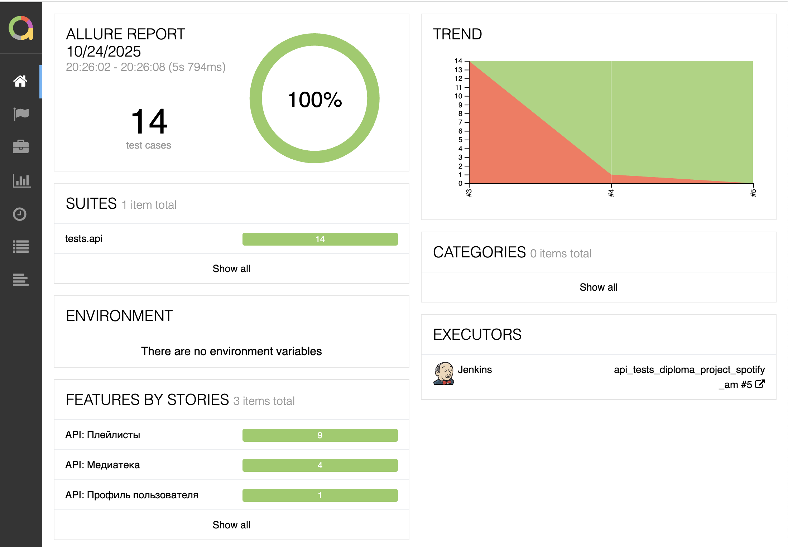</td>
    <td align="center" style="border: none; padding: 10px;">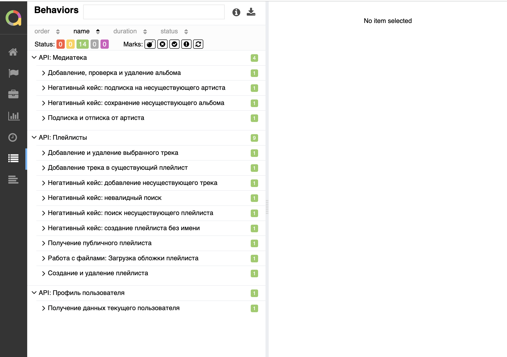</td>
  </tr>
  <tr>
    <td align="center" style="border: none; padding: 10px;">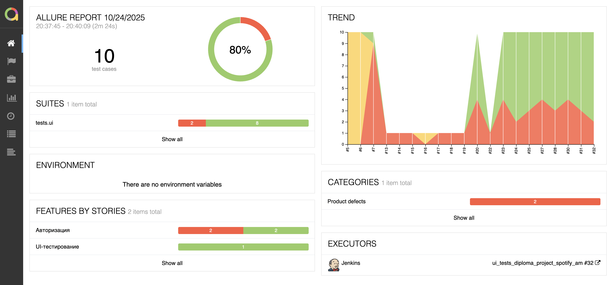</td>
    <td align="center" style="border: none; padding: 10px;">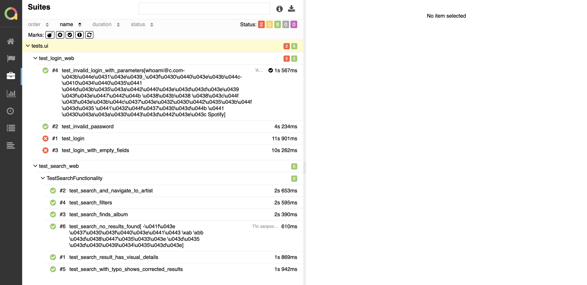</td>
  </tr>
</table>

Для детальной визуализации результатов тестов используется **Allure Report**.

Отчет генерируется как локально, так и в Jenkins. Он включает в себя:
* Разделение тестов по `Feature` и `Story`.
* Детальные шаги (`@allure.step`) для каждого теста.
* Для UI-тестов: скриншоты, `page source` и **видео** прохождения теста из Selenoid.
* Для API-тестов: аттачменты с деталями запроса и ответа (URL, заголовки, тело).
* Валидация схем Pydantic в API-тестах также отображается как шаги.

**Локальный запуск отчета:**
```bash
# (После запуска pytest с --alluredir=allure-results)
allure serve allure-results
```

---

###  Allure TestOps

В Jenkins отчет доступен по иконке Allure Report в строке билда.

Jenkins-сборки автоматически настроены на отправку результатов в Allure TestOps. 

<table align="center" border="0" style="border: none; margin-left: auto; margin-right: auto;">
  <tr>
    <td align="center" style="border: none; padding: 10px;">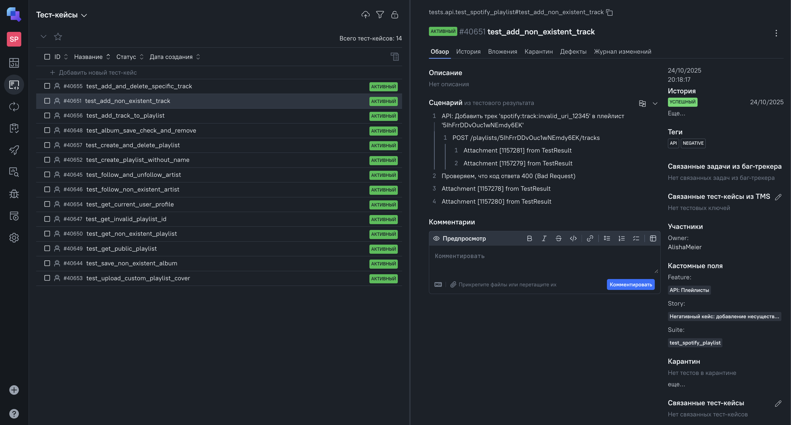</td>
    <td align="center" style="border: none; padding: 10px;">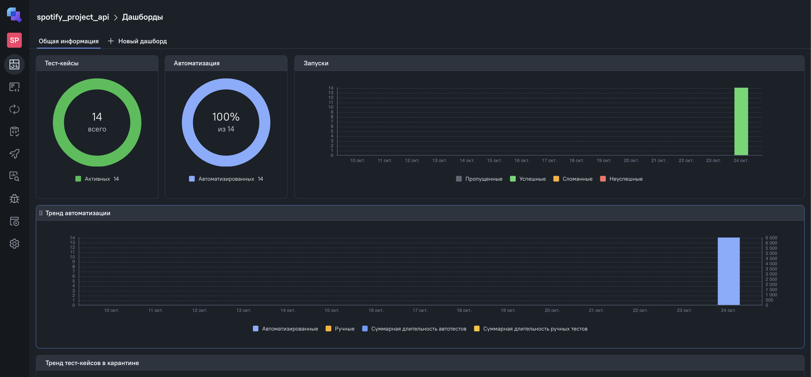</td>
  </tr>
  <tr>
    <td align="center" style="border: none; padding: 10px;">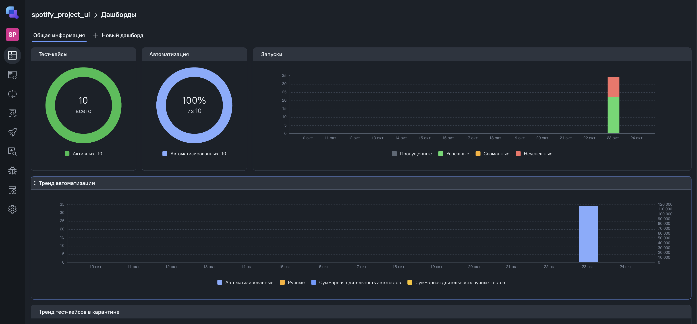</td>
    <td align="center" style="border: none; padding: 10px;">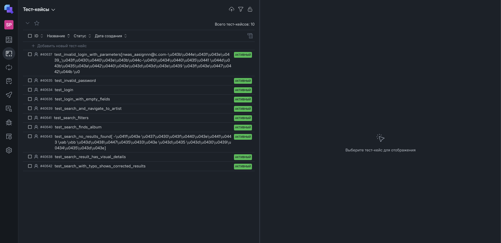</td>
  </tr>
</table>

Это позволяет: <br>
Вести историю тестовых прогонов. <br>
Анализировать "флакерующие" (flaky) тесты, коих в UI около 3 <br>
Создавать дашборды по состоянию автотестов. <br>


---

###  Уведомления Telegram


После каждого прогона тестов в Jenkins (и UI, и API) в Telegram отправляется автоматическое уведомление о результатах.
Для этого используется утилита allure-notifications.

<table align="center" border="0" style="border: none; margin-left: auto; margin-right: auto;">
  <tr>
    <td align="center" style="border: none; padding: 10px;"><strong>API тесты</strong></td>
    <td align="center" style="border: none; padding: 10px;"><strong>UI тесты</strong></td>
  </tr>
  <tr>
    <td align="center" style="border: none; padding: 10px;">
      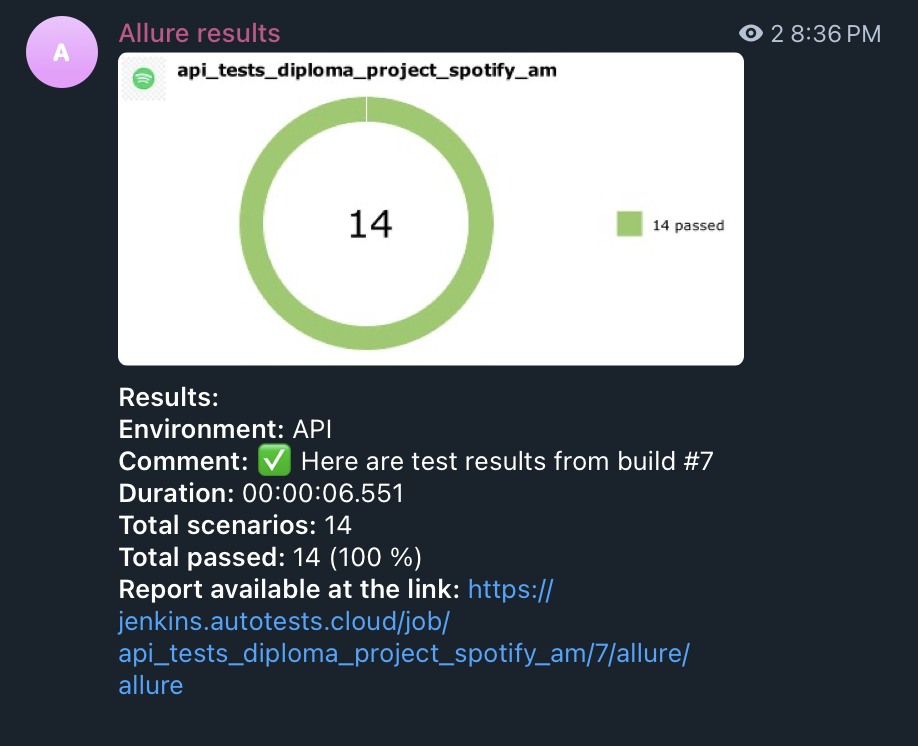
    </td>
    <td align="center" style="border: none; padding: 10px;">
      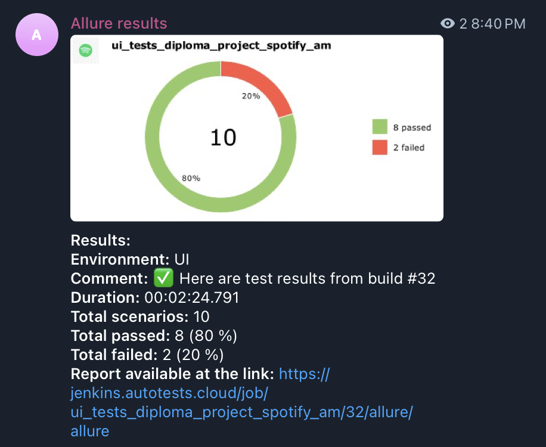
    </td>
  </tr>
</table>

<br>

Отчет содержит:
* **Название проекта:** Spotify_project
* **Логотип проекта**
* **Общую статистику** по тестам (сколько упало, прошло, сломалось).
* **Процент успешного выполнения.**
* **Ссылку** на полный Allure-отчет в Jenkins.

-----
<br>

## 🎥 Демонстрация работы тестов (локальный запуск)
 
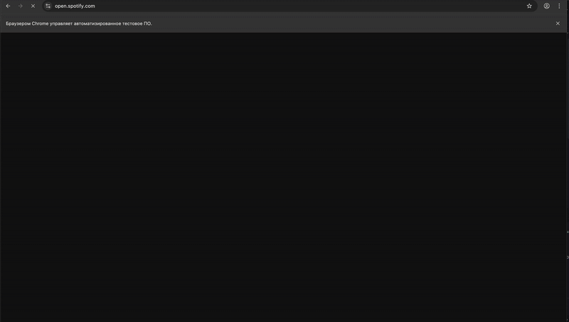

---
## 📚 Полезные ресурсы

- [Spotify Web API Reference](https://developer.spotify.com/documentation/web-api)
- [Spotify API Console](https://developer.spotify.com/console)
- [Allure Pytest Documentation](https://docs.qameta.io/allure/#_pytest)
- [Selene Documentation](https://yashaka.github.io/selene/)


## 👩‍💻 Автор

**Alisha Meier**  
QA Automation Engineer | Python + Pytest + Allure  
💬 [Написать в Telegram](https://t.me/cyber_neko)  


